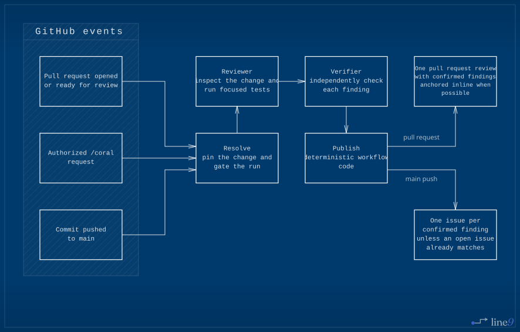
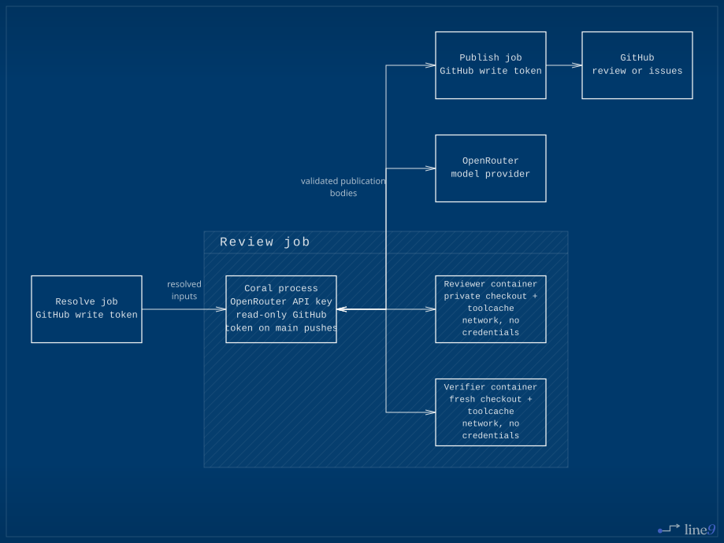

# 🪸 Coral

A code review agent that runs as a GitHub Actions workflow. Coral reviews pull requests and comments on them. It also reviews each push to `main` as one range, including a multi-commit push, and creates an issue for every confirmed finding that no open issue already describes.

Coral is a proof of concept and is early.

[](docs/diagrams/review-flow.mmd)

## Adding Coral to your repository

**1. Add the workflow.** Copy [`examples/coral.yml`](examples/coral.yml) to `.github/workflows/coral.yml` on your **default branch**. GitHub reads the file from there when a comment triggers a run, so a copy that lives only on a feature branch never runs. The `@v0.1.0` on the `uses:` line is what pins the Coral you installed; bump it to take a newer one.

```yaml
name: Coral

on:
  push:
    branches: [main]
  pull_request_target:
    types: [opened, ready_for_review]
  issue_comment:
    types: [created]
  pull_request_review_comment:
    types: [created]

concurrency:
  group: coral-${{ github.event.pull_request.number || github.event.issue.number || github.sha }}
  cancel-in-progress: false

jobs:
  coral:
    if: >-
      github.event_name != 'pull_request_target'
      || github.event.pull_request.head.repo.id == github.event.pull_request.base.repo.id
    permissions:
      contents: read
      issues: write
      pull-requests: write
    uses: kkestell/coral/.github/workflows/coral.yml@v0.1.0
    secrets:
      openrouter_api_key: ${{ secrets.OPENROUTER_API_KEY }}
      # openrouter_management_key: ${{ secrets.OPENROUTER_MANAGEMENT_KEY }}
      # coral_key_encryption_key: ${{ secrets.CORAL_KEY_ENCRYPTION_KEY }}
```

**2. Add the secret.** Coral reaches its model through [OpenRouter](https://openrouter.ai), so an OpenRouter key is the only credential you supply. The GitHub token comes from the job and expires with it.

Add the plain-key secret, or both management-mode secrets, under Settings → Secrets and variables → Actions:

- `OPENROUTER_API_KEY` — a plain API key, used as it is. Set a credit limit on it; that limit is what bounds the damage if it leaks.
- `OPENROUTER_MANAGEMENT_KEY` — a [provisioning key](https://openrouter.ai/settings/provisioning-keys). Coral mints a fresh API key for each run, capped at `spend_cap_dollars` and expiring within the hour. Nothing to rotate if one leaks.
- `CORAL_KEY_ENCRYPTION_KEY` — the Fernet key that carries a minted key from resolve to review. Generate it once and save the output as this secret: `python -c 'import base64, secrets; print(base64.urlsafe_b64encode(secrets.token_bytes(32)).decode())'`.

Prefer the management key if your account balance would hurt to lose. The workflow above passes the plain key; comment that line out and uncomment both management-mode lines to switch. Ciphertext crosses the job boundary, and the review runner decrypts the key only in its own process.

## Configuring Coral

Coral is configured in that workflow file and nowhere else. Comment-triggered and automatic pull-request reviews read it from the default branch. Add a `with:` block to the job to change any of these; leave it out and you get the defaults.

```yaml
    uses: kkestell/coral/.github/workflows/coral.yml@v0.1.0
    with:
      model: openai/gpt-5.6-luna
      reasoning_effort: ""
      time_budget_minutes: 20
      spend_cap_dollars: "2.00"
```

- `model` — any model on [OpenRouter](https://openrouter.ai/models), named exactly as it appears there. A `~` alias is refused, so the model a review ran on is always knowable from this file. Coral fetches the model's context window from OpenRouter at run time; a model it does not list stops the run and says so.
- `reasoning_effort` — passed to the provider as given. Empty asks for no reasoning block, leaving the provider its own default. What values a model accepts is the provider's rule, and its refusal is what you will read on the pull request.
- `time_budget_minutes` — how long Coral gets to review. The job's own timeout is ten minutes more than this, so the largest budget is 350.
- `spend_cap_dollars` — what one review may spend. A review that reaches it stops, and says what it spent on the pull request. With a management key it is also the limit the run's own key is minted with, so the provider refuses the spending too. Every review ends with what it cost, whether or not it came near the cap.

## Asking for a review

Comment `/coral` on a pull request, or as a reply on the diff, to ask for a review at any time. Coral reacts with 👀, then posts its review.

Anyone with write access can ask. Coral only comments: it never pushes, approves, or requests changes.

## Reviewing main

The caller file above reviews every push to `main` as one range from the prior main tip through the pushed head, including a multi-commit push. It creates one issue for each finding its verifier confirms when no open issue already describes that defect. A main-push review with no confirmed findings creates no issue. A failed main-push review is visible in Actions and creates no issue.

Each issue is labeled `coral` and `severity: low`, `severity: medium`, or `severity: high`. Coral creates any of those four labels your repository does not have, and never touches the color or description of one it already has.

## Risks

The measures below limit the damage. None of them stop a determined attacker from reaching the OpenRouter key or the workflow's GitHub token.

[](docs/diagrams/credential-boundaries.mmd)

### Mitigations

- Never reviews a fork, and ignores `/coral` from anyone without push access — read off your repository's collaborator permissions, so a read-only member of your organization cannot spend a review. Every change it runs is code somebody with push access could have pushed anyway.
- Runs the agent's shell in an unprivileged container: no added capabilities, no Docker socket, and a cap on the memory, processors, and processes it can take of the runner.
- Puts no credential in that container: no OpenRouter key, no GitHub token, none of the runner's variables. It gets a copy of the checkout and the toolcache read-only.
- Limits the agent's job to read-only `contents` and `issues` scopes. The write scopes live in the jobs that post, which never run agent code.
- Never pushes, approves, or requests changes. A bad review costs a comment, not a merge.
- Mints a per-run API key from a management key, so a leak expires on its own.

### Remaining risks

- The container has network access, which dependency installs need. Anything the agent can read, it can send.
- A container escape reaches the review job, which holds the OpenRouter key.
- OpenRouter and whichever provider it routes to see the diff, files the agent opens, command output, and the conversation. Do not install Coral where that is unacceptable.
- Prompt injection works. The diff and the conversation are attacker-controlled text in the model's context, so a review can be steered into missing a finding or posting text somebody else wrote.
- Automatic reviews use `pull_request_target`, so the default branch supplies the workflow code. Coral checks out the pinned head only in its read-only review job and executes agent-chosen operations only in the credential-free container.

Prefer the management key, set a credit limit on whichever key you use, keep write access narrow, and treat Coral's comments as suggestions from an unreliable reviewer.

## Development

Coral is Python, built with `uv`. `.agents/docs/development.md` covers setup and the commands.
